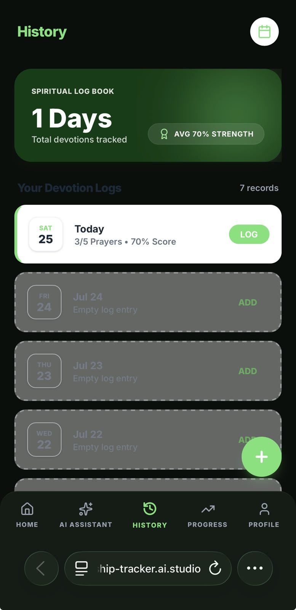
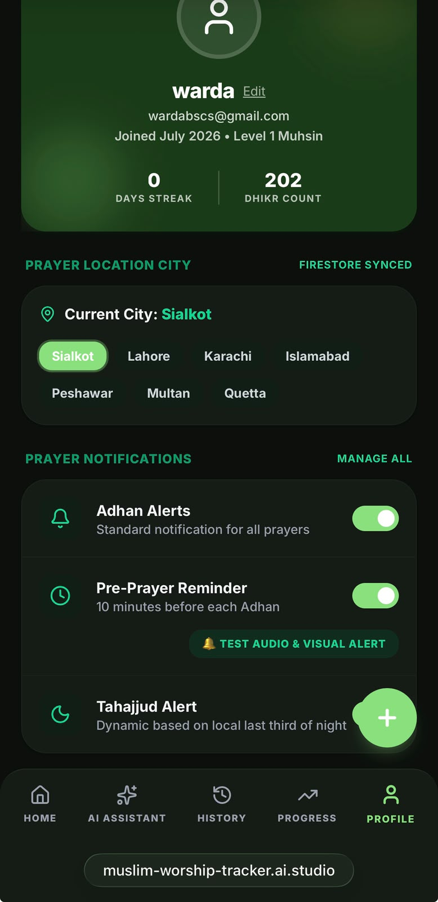

# Sakinah — Muslim Worship Tracker & AI Assistant

[](https://muslim-worship-tracker.vercel.app/)

**Sakinah** (سَكِينَة — inner peace and tranquility) is an all-in-one Islamic worship tracking application and AI-powered spiritual companion designed to help Muslims build, maintain, and track consistent daily worship habits in a distraction-free, privacy-first environment.

---

## 🔗 Live Application

Access the live application here:  
👉 **[https://muslim-worship-tracker.vercel.app/](https://muslim-worship-tracker.vercel.app/)**

---

## 🎯 Real Problem Solved & Target Audience

### The Problem
In today's fast-paced digital environment, modern Muslims face several daily spiritual friction points:
1. **Inconsistent Worship Routine**: Difficulty in tracking daily prayers (Salah), Dhikr, and Quran recitation consistently across busy days.
2. **Inaccurate Local Prayer Timings**: Many prayer apps use static or outdated offline tables that fail to adjust accurately for seasonal shifts or specific regional calculation methods (such as Hanafi Asr timing in Pakistan).
3. **Lack of Personal Guidance**: Finding authentic Islamic advice, Quranic duas, and personalized worship goal plans often requires searching through ad-cluttered websites or unverified forums.
4. **Data Isolation & Privacy Concerns**: Shared devices or generic trackers frequently mix user histories, exposing private reflection logs and chat history across accounts.

### The Solution & Audience
**Sakinah** provides a unified, elegant solution tailored for believers worldwide (with specialized localized timing calculations for major cities in Pakistan). It combines real-time astronomical prayer timing algorithms, interactive habit trackers, digital Tasbih counters, and an **isolated per-user Sakinah AI Assistant** powered by Google Gemini to offer authentic, personalized spiritual encouragement.

---

## ✨ Features Overview

### 1. 🕌 Dynamic & Accurate Prayer Times
- **Dual Engine Calculation**: Uses the `adhan` JS library for high-precision astronomical calculations (University of Islamic Sciences, Karachi method with Hanafi juristic rule) paired with real-time fallbacks from the **Aladhan API**.
- **Location & Date Responsive**: Instantly adjusts Fajr, Dhuhr, Asr, Maghrib, and Isha timings based on selected date and city (Sialkot, Lahore, Karachi, Islamabad, Peshawar, Multan, Quetta).
- **Interactive Checklist**: Mark prayers as completed with instant audio chime feedback and dynamic progress visualizers.

### 2. 🤖 Sakinah AI Assistant (Permanent Feature)
- **Dedicated AI Companion**: Embedded directly into the app with a permanent tab and home screen shortcut.
- **User-Isolated Chat History**: Powered by **Firebase Firestore** (`users/{uid}/assistant/chatHistory`), ensuring each user's conversation remains strictly private and isolated to their account.
- **Context-Aware Personalization**: Generates warm, tailored guidance referencing the user's streak, dhikr count, and daily spiritual score without invading privacy.

### 3. 📿 Digital Tasbih & Dhikr Counter
- **Interactive Audio Feedback**: Tap-to-count interface with soothing sound effects and haptic visual feedback.
- **Goal Presets**: Set custom goals (33, 100, or unlimited) for SubhanAllah, Alhamdulillah, Allahu Akbar, and Astaghfirullah.
- **Cumulative Tracking**: Total lifetime Dhikr counts sync seamlessly to the user's profile.

### 4. 📖 Quran Reading Tracker
- **Daily Progress Logging**: Track pages or verses read daily with custom goal milestones.
- **Completion History**: Records daily logs to visualize reading consistency over time.

### 5. 💡 AI Spiritual Reflection Generator
- **Daily Inspiration**: One-tap reflection engine using Gemini AI to craft custom motivational thoughts and Quranic reminders based on the user's daily worship progress.

### 6. 🔒 Firebase Authentication & Cloud Sync
- **Secure Auth**: Full support for Google Sign-In and Email/Password authentication via Firebase Auth.
- **Cloud Persistence**: Stores logs, streaks, level/XP stats, and chat history securely in Cloud Firestore.

### 7. 🎨 Elegant Modern Interface
- **Dark & Light Mode**: Seamless dark/light theme switching tailored for night worship (Tahajjud).
- **Responsive Layout**: Designed mobile-first for touch screens while scaling gracefully to desktop layouts.

---

## 🧠 The AI Feature & System Prompt

The **Sakinah AI Assistant** serves as a compassionate Islamic educational and worship planning assistant. It is powered by **Google Gemini 2.5 Flash** via server-side API proxy routes to protect API keys.

### AI Capabilities
- **Educational QA**: Explains fundamental Islamic concepts (*Taqwa*, *Ihsan*, *Sabr*, *Tawakkul*) in intuitive terms.
- **Authentic Duas**: Recommends authentic Quranic and Prophetic duas complete with Arabic text, English transliteration, and translation.
- **Worship Planning**: Helps structure practical goals (e.g., establishing a Fajr routine, preparing for Tahajjud, building a daily Quran habit).
- **Location Privacy Enforcer**: Strict rules prevent the AI from unnecessarily mentioning the user's city unless explicitly asked about prayer times, Qibla, or local mosques.

### Official System Prompt (`server.ts`)
```text
You are Sakinah AI, a warm, compassionate, authentic, and knowledgeable Islamic educational and worship assistant.
You are embedded inside the Sakinah Muslim Worship Tracker application.

Your Core Mandates:
1. Answer Islamic educational questions accurately using simple, clear, accessible language.
2. Provide gentle, uplifting motivation for daily worship (Salah, Dhikr, Quran recitation, Tahajjud, Fasting).
3. Suggest authentic Quranic and Prophetic duas with Arabic text, clear transliteration, and English translation whenever appropriate.
4. Help users plan realistic worship goals (e.g., establishing a Fajr routine, structuring daily Quran reading, building Dhikr habits).
5. Explain Islamic concepts (such as Taqwa, Ihsan, Sabr, Tawakkul, Sakinah) in intuitive, practical terms.
6. Personalize your response warmly using the provided user context ([User Context: Name, Current Streak, Total Dhikr, Today's Spiritual Score, City]) to encourage their spiritual journey.
7. CRITICAL LOCATION RULE: You MUST NEVER mention or reference the user's selected city (such as Sialkot, Lahore, Karachi, Islamabad, etc.) UNLESS the user explicitly asks a question about prayer times, Qibla direction, local mosques, weather, or another location-specific topic. For all general Islamic questions, duas, motivation, Quran explanations, worship advice, goal planning, or conversations, do NOT mention or reference the city or location at all. Respond naturally and focus strictly on answering the user's question.
8. Always maintain respectful Islamic etiquette (e.g., starting with warm greetings if appropriate, wishing blessings). Keep responses well-formatted with clean spacing and bullet points where helpful. Avoid sectarian debates.
```

---
## 🤖 AI-Assisted Development

Sakinah was first designed using **Google Stitch**, where the application's interface and user experience were created through natural language prompts. The project was then exported to **Google AI Studio**, where prompt-driven development was used to iteratively build and enhance the application. Google AI Studio assisted in implementing features such as Firebase Authentication, Cloud Firestore integration, the Gemini-powered AI Assistant, prayer tracking, Qur'an progress tracking, and other application functionality. All generated code was reviewed, tested, and refined throughout the development process.
## 🛠️ Tools, Services & Technologies Used

| Category | Technology / Service | Description |
| :--- | :--- | :--- |
**UI Design** | Google Stitch | Designed the application's high-fidelity user interface and user experience before development. |
| **AI Development** | Google AI Studio | Used prompt-driven development to generate, refine, and implement application features, Firebase integration, and AI functionality. |
| **Frontend Framework** | React 18, TypeScript, Vite | Modern, fast single-page app architecture |
| **Styling & UI** | Tailwind CSS, Motion (Framer Motion) | Utility-first responsive design & smooth animations |
| **Icons** | Lucide React | Clean, accessible vector icons |
| **Backend & Server** | Express.js, `tsx`, `esbuild` | Full-stack Node.js server proxying AI requests |
| **AI Engine** | Google Gemini 2.5 Flash (`@google/genai`) | Server-side LLM for AI reflections and chat |
| **Database & Auth** | Firebase Auth & Cloud Firestore | Cloud user management & per-user isolated data sync |
| **Prayer Calculation** | `adhan` (npm) & Aladhan REST API | Astronomical algorithms & live city timing sync |
| **Deployment** | Vercel / Cloud Run | Scalable production hosting |

---
## 📸 Screenshots

### 🏠 Home Screen & Dhikr Counter


### 🤖 Sakinah AI Assistant


### 📖 Prayer Log & Post-Prayer Dhikr


### 📊 Worship History


### ⚙️ Settings


## 💻 How to Run the Project Locally

### Prerequisites
- **Node.js**: v18.0.0 or higher
- **npm** or **bun** / **yarn**

### 1. Clone the Repository
```bash
git clone https://github.com/your-username/muslim-worship-tracker.git
cd muslim-worship-tracker
```

### 2. Install Dependencies
```bash
npm install
```

### 3. Configure Environment Variables
Create a `.env` file in the project root (reference `.env.example`):
```env
GEMINI_API_KEY=your_google_gemini_api_key_here
```

Ensure your `firebase-applet-config.json` is properly configured with your Firebase project credentials.

### 4. Run Development Server
```bash
npm run dev
```
The application will be accessible at `http://localhost:3000`.

### 5. Build for Production
```bash
npm run build
npm start
```

---

## 📄 License
This project is open-source and available under the **MIT License**.
